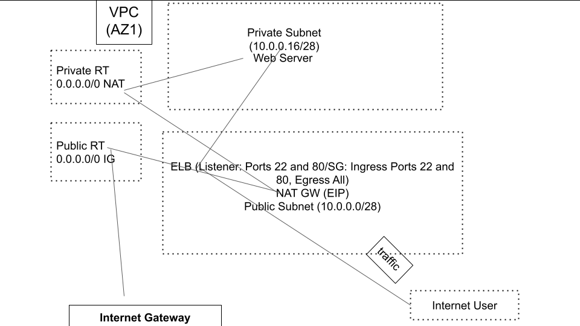

terraform-ec2-docker-webserver-elb
==================================
Two AWS EC2 instances running a docker webserver (yeasy/simple-web:latest) container behind an AWS ELB (Classic).  The two EC2 instances are running in a private network using a EC2 bastion instance (only exposed to your own IP address) to maintain.  Docker container listens on port 80 and is exposed to the instance on port 8080.  The AWS ELB (Classic) listens on port 80 and forwards all traffic to the two EC2 instances.

Objective
---------
```yaml
Write automation with Terraform

Two EC2 instances, each will have the following docker container, run without modification
of the image yeasy/simple-web

The container listens internally on port 80. It should be exposed on the instance on port 8080

The instance should not allow access to the webapp except via the load balancer

An Elastic Load Balancer that listens on port 80 and forwards all traffic to both EC2 instances
```

Layout
------
One Bastion Instance within the public subnet <br />
Two EC2 Instances running a Web Server on each via Docker Container (yeasy/simple-web ) within the private subnet <br />
Bastion Host is able to ssh into each EC2 Instance <br />
Both EC2 Instances behind an AWS ELB (Classic) listening on web port 80 <br />
Both EC2 Instances security group allows inbound (ingress) ssh from the Bastion Instance <br />
Both EC2 Instances security group allows inbound from the ELB security group <br />
The ELB security group allows outbound on port 8080 (EC2 instance port) <br />
ELB health check TCP port 80

Network
-------
VPC - 10.0.0.0/26 <br />
Internet GW - router connects a VPC to the internet <br />
Public Route Table - associated with VPC and allow traffic to IG <br />
Public Subnet - 10.0.0.0/28 <br />
Route Table Association - Associate public subnet with a IG route <br />
NAT GW - Associate to Public Subnet and the Elastic IP Address (Reserved public IP address that you can assign to any EC2 instance to mask failure) <br />
Private Subnet - 10.0.0.16/28 <br />
Private Route table - Control network traffic <br />
Private Route Table - allow traffic utilizing the route to NAT Gateway <br />
Route Table Association - Associate private subnet with a IG route


Diagram
-------


Pre-requisite
-------------
Before starting with the project, you should have the following things

```yaml
1. AWS account (Free-Tier)
2. IAM user-created
3. AWS CLI tool installed
4. Terraform installed
5. Environment variable set for Terraform
```

Export Environment variables for keys instead of variables - more secure
``bash
$ export AWS_ACCESS_KEY_ID=EXAMPLEXXXX
$ export AWS_SECRET_ACCESS_KEY=EXAMPLEXXXX
```

Requirements
------------

| Name | Version |
|------|---------|
| terraform | >= 1.0 |
| awscli | >= 2.65 |

Providers
---------

| Name | Version |
|------|---------|
| awscli | >= 2.65 |

Installing Terraform | Linux
----------------------------

1. Downloading Terraform 1.0.1.
```bash
$ mkdir /tmp/downloads && cd /tmp/downloads
$ sudo wget https://releases.hashicorp.com/terraform/1.0.1/terraform_1.0.1_linux_amd64.zip
$ sudo unzip terraform_1.0.1_linux_amd64.zip
```
2. Adding terraform to your running services.
```bash
$ sudo mv terraform /usr/local/bin/terraform
```
3. To check if Terraform v1.0.1 is installed correctly run the following command.
```bash
$ terraform -version
```
and it will show you that you have installed terraform 1.0.1

Usage
-----

```yaml
Utilizing the make command

# Lists a help menu
$ make help

# Run all terraform commands
$ make tf-all

# Cleanup
$ make tf-clean

Utilizing the bash script
# Running the script will run all terraform commands
$ ./scripts/tf_script.sh
```

Future To Do's (nice to have's)
-------------------------------

```yaml
Implement S3 backend for tfstate (In originals directory)
1. create iam user
2. Attach iam user policy with AmazonS3FullAccess & AmazonDynamoDBFullAccess
   to the created iam user in step 1
3. Put bucket policy against bucket
4. Put bucket versioning against bucket with status enabled
5. Create iam access key for iam user created in step 1
```

Authors
-------

Managed by [ntanenbaum](https://github.com/ntanenbaum).

